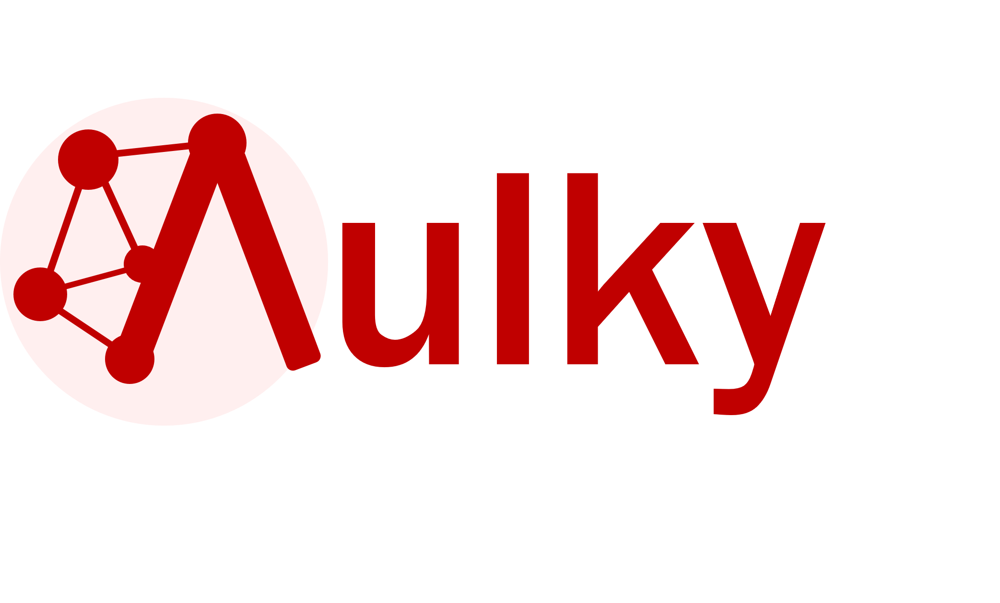
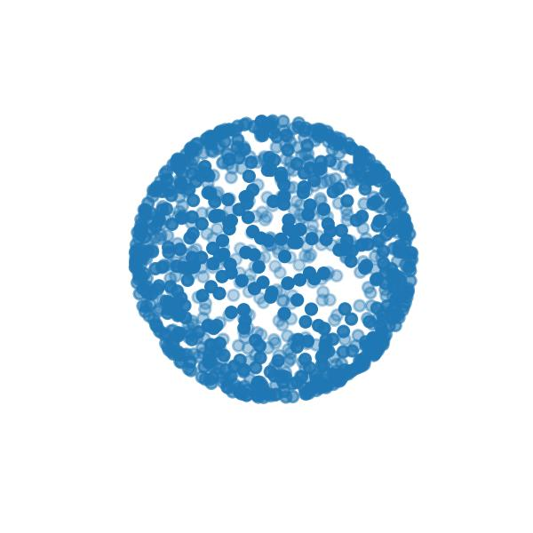
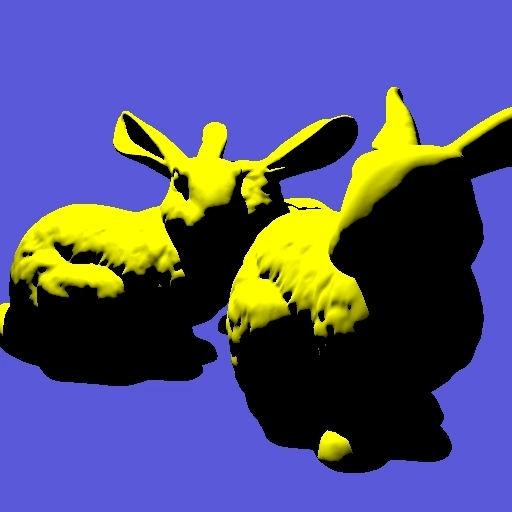

Examples showing *vulky* and how to create rendering applications in few lines of code.
Vulky exposes a simplified view of Vulkan API, but at the same time is compact, elegant and
with little overhead. 

[Go to Vulky documentation here.](https://rendervous.github.io/vulky_project/)

<table>
<tr> 
<td>
    
</td>
<td>
    <b>Devices:</b> Creating and destroying devices in vulky, manipulating vectors and matrices. 
    
</td>
</tr>

<tr>
<td>
    
</td>
<td>
    <b>Basic Compute:</b> Computing the Mandelbrot set to an image. 
    
</td>
</tr>

<tr>
<td>
    
</td>
<td>
    <b>Basic Rasterization:</b> Drawing primitives to a framebuffer with depth-test. 
    
</td>
</tr>

<tr>
<td>
    
</td>
<td>
    <b>Vertex Buffers:</b> Drawing primitives based on vertices and indices. 

</td>
</tr>

<tr>
<td>
    
</td>
<td>
    <b>OBJ Viewer:</b> Loading an OBJ and rendering the properties of the geometry with rasterization. 
    
</td>
</tr>

<tr>
<td>
    
</td>
<td>
    <b>Texture Mapping: </b> Binding textures and samplers. 
    
</td>
</tr>

<tr>
<td>
    
</td>
<td>
    <b>Basic Raytracing:</b> Raytracing pipeline, building ADS, updating. 
    
</td>
</tr>

<tr>
<td>
    
</td>
<td>
    <b>Shadow cast:</b> Raytracing pipeline, raytracing programs. 
    
</td>
</tr>

<tr>
<td>
    
</td>
<td>
    <b>Whitted Raytracing:</b> GPU Pointers  
    
</td>
</tr>

</table>

